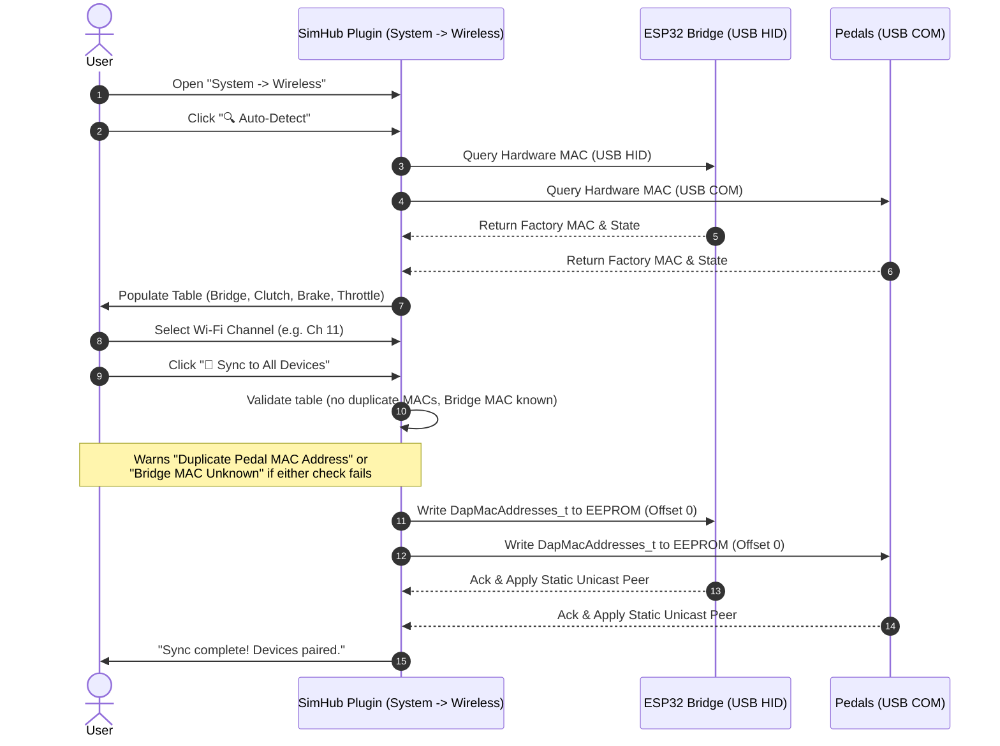
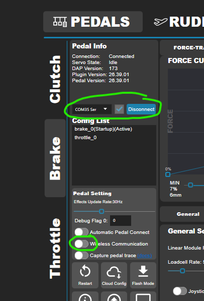
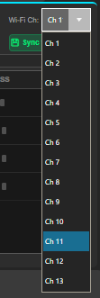
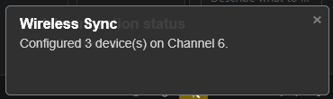

# Wireless Management & Pure Unicast Pairing Guide

This guide explains how to pair, assign, and synchronize your DIY Sim Racing Active Pedals and ESP32-S3 Bridge using the pure unicast ESP-NOW wireless management system in SimHub.

---

## 1. Overview & Architecture

The wireless communication uses Espressif's high-speed **ESP-NOW** protocol operating in **100% Pure Static Unicast Mode** (no broadcast frames):

- **Factory eFuse Hardware MACs**: Every pedal and Bridge module uses its permanent, factory-burned hardware MAC address.
- **Dedicated EEPROM Partition**: The routing table `DapMacAddresses_t` (containing the MAC addresses for Bridge, Clutch, Brake, Throttle and the active Wi-Fi channel) is stored in EEPROM at fixed offset 0, completely isolated from pedal motion configs (offset 64).
- **Paced, Flow-Controlled Sends**: Every ESP-NOW send (bridge↔pedal and pedal↔pedal rudder sync) goes through a single in-flight/backoff-tracked send path per device, so the radio's transmit queue is never hammered faster than it can drain - this is what makes sustained unicast traffic (including the 2 ms rudder-sync cadence) hold up over long sessions instead of stalling.
- **Multi-Rig Isolation**: Multiple simulator rigs operating in the same room or household will never interfere with each other - a packet addressed to your Throttle's MAC is never delivered to anyone else's radio, including your own other pedals.

---

## 2. Step-by-Step Initial Setup & MAC Sharing

  
*Figure 1: Wireless Management tab in SimHub (`System -> Wireless`).*

> [!IMPORTANT]
> **Important note (USB COM vs. Wireless):**  
> When a pedal is connected to the PC via USB-C cable (COM port), the **"Wireless Communication" option must be temporarily disabled (OFF)** in that pedal's tab in SimHub.  
> This gives the USB serial connection priority, so hardware MAC queries and EEPROM writes can complete quickly and reliably. Once synced, you can unplug the USB cable and re-enable wireless communication.

---

### Pairing Workflow

### Step-by-Step Guide

https://github.com/user-attachments/assets/96f13742-3679-4350-b759-af907de7c6d0

1. **Connect devices via USB**:
   - Connect the ESP32-S3 Bridge to the PC via USB (it will show up as `USB-HID Online`).
   - Connect the pedals to the PC via USB-C cable, one at a time or all at once.
2. **Temporarily disable Wireless Communication in the pedal tab**:
   - In SimHub, open the relevant tab (e.g. *Brake* or *Throttle*).
   - Turn **"Wireless Communication" OFF**, so the COM port is actively used for data transfer.
   - Select the pedal's COM port from the dropdown and click **"Connect"** - the pedal must be actively connected over its COM port for Auto-Detect and Sync to reach it.

     
   *Figure 2: "Wireless Communication" set to OFF on the Brake tab while connected via USB.*
3. **Open the Wireless Management tab**:
   - Navigate to **System -> Wireless**.
4. **Start auto-detection**:
   - Click **"🔍 Auto-Detect"**.
   - The plugin queries all USB devices and automatically fills in the real hardware MAC addresses in the rows (`BRIDGE`, `CLUTCH`, `BRAKE`, `THROTTLE`).
   - Use the **"🔔 Beep"** button to test which physical pedal is being addressed.
5. **Select the Wi-Fi channel**:
   - Choose the desired Wi-Fi channel in the top-right dropdown (e.g. **Ch 11**, or any channel 1-13 that's free of interference).

     
   *Figure 3: Wi-Fi channel selector (Ch 1-13), top right of the Wireless tab.*
6. **Synchronize**:
   - Click **"💾 Sync to All Devices"**.
   - The complete routing table is now flashed into the EEPROM (offset 0) of the Bridge and every connected pedal.
   - > [!IMPORTANT]
     > A pedal learns the Bridge's MAC address **exclusively** through this sync - there is no way to teach it wirelessly afterwards. Make sure the **BRIDGE row already shows a real MAC address** (not `--`) before you sync, otherwise the sync will write an empty bridge address into that pedal's EEPROM. The plugin now warns about this automatically with the **"Bridge MAC Unknown"** dialog, letting you cancel or proceed deliberately.
   - If two pedal roles accidentally end up with the same MAC address (e.g. from a mixed-up USB COM assignment during Auto-Detect), the **"Duplicate Pedal MAC Address"** dialog also appears - in that case, re-run Auto-Detect (ideally with only one pedal connected via USB at a time) or correct the MAC fields manually before continuing.

     
   *Figure 4: Status line after a successful "Sync to All Devices".*
7. **Start wireless operation**:
   - Disconnect the pedals' USB cables.
   - Re-enable **"Wireless Communication"** in the SimHub pedal tab.
   - The pedals now connect to the Bridge purely via static unicast.

---

## 3. Wi-Fi Channel Management (Channels 1-13)

By default the system operates on **channel 11**. If your home Wi-Fi or neighboring networks are causing heavy interference on 2.4 GHz, you can switch to a different channel at any time:
- Select the new channel (1-13) from the dropdown in the top right.
- Click **"💾 Sync to All Devices"** while the devices are connected via USB.
- Both the Bridge and the pedals switch to the new channel and store it permanently in EEPROM.

---

## 4. Troubleshooting

- **MAC address isn't detected automatically**:
  - Check whether the pedal is recognized in its pedal tab.
  - Make sure **"Wireless Communication" is set to OFF** while the pedal is connected via USB.
  - Click **"🔍 Auto-Detect"** or **"📥 Read Device"** again.
  - If Auto-Detect shows a **"Pedal Role Mismatch"** toast notification, the device connected on that USB port still identifies itself internally as a different role (e.g. "Throttle" on the Brake port). In that case the detected MAC is **not** applied automatically, to avoid accidentally overwriting a pedal - only reassign it deliberately via that pedal's own tab (the "Set as Default" dialog, with confirmation).
- **Pedal stays permanently stuck on "Read Pedal Config" (wireless), even though it worked fine over USB before**:
  - Most common cause: the **Bridge's MAC was never written to this pedal's EEPROM** - usually because during the last "Sync to All Devices", only this one pedal was connected via USB while the Bridge row in the plugin still showed `--`. Since the Bridge's MAC is learned exclusively through that sync, the pedal will then permanently and silently ignore every packet from the Bridge (it keeps happily sending its own telemetry, though, since sending doesn't require a known Bridge MAC).
  - Check the pedal's boot log (via a USB serial monitor) for the line `[MAC] Configured Bridge MAC: XX:XX:XX:XX:XX:XX` - if it shows `00:00:00:00:00:00`, that's the cause.
  - Fix: connect the pedal via USB, make sure the BRIDGE row in the Wireless tab shows a real MAC (run "🔍 Auto-Detect" with the Bridge connected if needed), then click **"💾 Sync to All Devices"** again while the affected pedal is connected via USB.
  - As of the latest update, the plugin now warns about exactly this *before* writing (the **"Bridge MAC Unknown"** dialog), so this situation shouldn't happen unnoticed anymore.
- **Pedal doesn't connect wirelessly to the Bridge**:
  - Make sure the Bridge's MAC was written to the pedal's EEPROM (visible in the boot log: `[MAC] Configured Bridge MAC: XX:XX:XX:XX:XX:XX`).
  - Check that the Wi-Fi channel matches between the Bridge and the pedal.
- **Checking signal strength (RSSI)**:
  - In the Wireless tab, the **WIRELESS** column shows real-time signal strength (e.g. `-45 dBm` = Excellent, `-70 dBm` = Good, `-85 dBm` = Weak).
