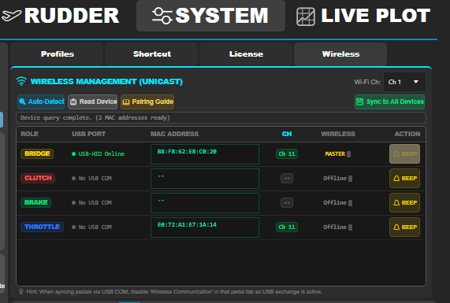
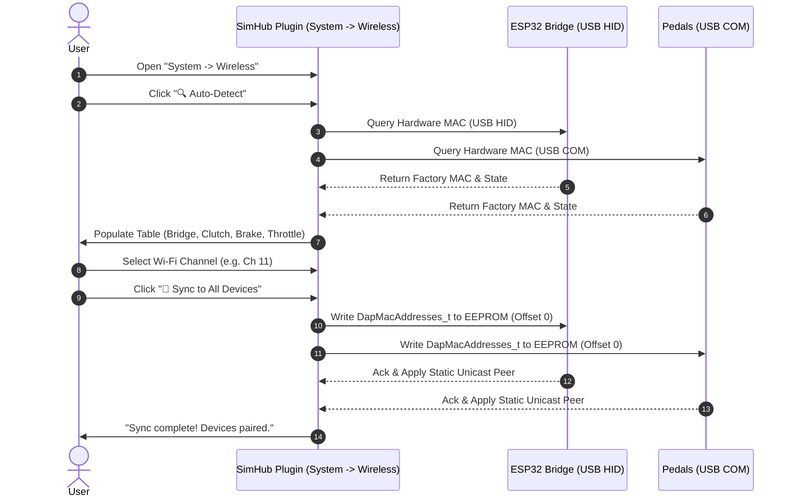

# Wireless Management & Pure Unicast Pairing Guide

This guide explains how to pair, assign, and synchronize your DIY Sim Racing Active Pedals and ESP32-S3 Bridge using the pure unicast ESP-NOW wireless management system in SimHub.

---

## 1. Overview & Architecture

The wireless communication uses Espressif's high-speed **ESP-NOW** protocol operating in **100% Pure Static Unicast Mode** (no broadcast frames):

- **Factory eFuse Hardware MACs**: Every pedal and Bridge module uses its permanent, factory-burned hardware MAC address.
- **Dedicated EEPROM Partition**: The routing table `DapMacAddresses_t` (containing the MAC addresses for Bridge, Clutch, Brake, Throttle and the active Wi-Fi channel) is stored in EEPROM at fixed offset 0, completely isolated from pedal motion configs (offset 64).
- **Buffer-Starvation Protection**: Pure unicast communication prevents broadcast buffer overflows and eliminates connection drops.
- **Multi-Rig Isolation**: Multiple simulator rigs operating in the same room or household will never interfere with each other.

---

## 2. Step-by-Step Initial Setup & MAC Sharing

  
*Figure 1: Wireless Management tab in SimHub (`System -> Wireless`).*

> [!IMPORTANT]
> **Wichtiger Hinweis (USB COM vs. Wireless):**  
> Wenn ein Pedal per USB-C-Kabel (COM-Port) an den PC angeschlossen ist, muss im jeweiligen Pedal-Reiter in SimHub die Checkbox/Option **"Wireless Communication" temporär deaktiviert (OFF)** werden.  
> Dadurch erhält die serielle USB-Kommunikation Priorität, damit Hardware-MAC-Abfragen und EEPROM-Schreibvorgänge schnell und zuverlässig durchgeführt werden können. Nach dem Synchronisieren kann das USB-Kabel abgezogen und die drahtlose Kommunikation wieder aktiviert werden.

---

### Pairing Workflow

### Schritt-für-Schritt-Anleitung (DE)

1. **Geräte per USB verbinden**:
   - Schließe die ESP32-S3 Bridge per USB an den PC an (erscheint als `USB-HID Online`).
   - Schließe die Pedale nacheinander oder gleichzeitig per USB-C-Kabel an den PC an.
2. **Wireless Communication im Pedal-Tab temporär ausschalten**:
   - Öffne in SimHub den jeweiligen Reiter (z. B. *Brake* oder *Throttle*).
   - Schalte **"Wireless Communication" auf OFF**, damit der COM-Port aktiv für die Datenübertragung genutzt wird.
3. **Wireless Management Tab öffnen**:
   - Navigiere zu **System -> Wireless**.
4. **Auto-Erkennung starten**:
   - Klicke auf **"🔍 Auto-Detect"**.
   - Das Plugin fragt alle USB-Geräte ab und trägt die echten Hardware-MAC-Adressen automatisch in die Zeilen (`BRIDGE`, `CLUTCH`, `BRAKE`, `THROTTLE`) ein.
   - Mit dem **"🔔 Beep"**-Button kannst du testen, welches physische Pedal angesprochen wird.
5. **WLAN-Kanal wählen**:
   - Wähle oben rechts den gewünschten Wi-Fi-Kanal (z. B. **Ch 11** oder einen störungsfreien Kanal 1–13).
6. **Synchronisieren**:
   - Klicke auf **"💾 Sync to All Devices"**.
   - Die komplette Routing-Tabelle wird nun in das EEPROM (Offset 0) der Bridge sowie aller verbundenen Pedale geflasht.
7. **Drahtlosbetrieb starten**:
   - Trenne die USB-Kabel der Pedale.
   - Aktiviere im SimHub-Pedal-Tab wieder **"Wireless Communication"**.
   - Die Pedale verbinden sich nun rein über statischen Unicast mit der Bridge.

---

## 3. Wi-Fi-Kanalverwaltung (Kanäle 1–13)

Standardmäßig arbeitet das System auf **Kanal 11**. Sollte dein Heim-WLAN oder Nachbarnetzwerke auf 2.4 GHz stark funken, kannst du jederzeit auf einen anderen Kanal wechseln:
- Wähle in der Dropdown-Liste oben rechts den neuen Kanal (1–13).
- Klicke auf **"💾 Sync to All Devices"**, während die Geräte per USB angeschlossen sind.
- Sowohl Bridge als auch Pedale schalten auf den neuen Kanal um und speichern ihn permanent im EEPROM.

---

## 4. Benötigte Screenshots / Required Screenshots

Um die Dokumentation mit ansprechenden Bildern zu vervollständigen, werden folgende Screenshots benötigt (abzulegen unter `docs/media/images/`):

| Dateiname | Beschreibung | Wo aufzunehmen? |
| :--- | :--- | :--- |
| **`simhub_system_wireless_tab.png`** | Übersicht des neuen Wireless-Tabs mit allen 4 Zeilen (Bridge, Clutch, Brake, Throttle), ausgefüllten MAC-Adressen, Status-LEDs und RSSI-Anzeige. | SimHub Plugin -> *System* -> *Wireless* |
| **`simhub_pedal_wireless_toggle_off.png`** | Ansicht eines Pedal-Tabs (z. B. Brake) mit hervorgehobener Checkbox **"Wireless Communication" (auf OFF gesetzt)** bei aktiver USB-Verbindung. | SimHub Plugin -> *Pedal Tab (Brake)* |
| **`simhub_wireless_sync_success.png`** | Screenshot direkt nach dem Klick auf **"💾 Sync to All Devices"** mit der Erfolgsmeldung in der Statuszeile. | SimHub Plugin -> *System* -> *Wireless* |
| **`simhub_wireless_channel_dropdown.png`** | Aufgeklapptes Wi-Fi-Kanal-Dropdown-Menü (Ch 1 bis 13). | SimHub Plugin -> *System* -> *Wireless* (oben rechts) |

---

## 5. Fehlerbehebung / Troubleshooting

- **MAC-Adresse wird nicht automatisch erkannt**:
  - Prüfe, ob das Pedal im Pedal-Tab erkannt wird.
  - Stelle sicher, dass **"Wireless Communication" auf OFF** steht, während das Pedal per USB angeschlossen ist.
  - Klicke erneut auf **"🔍 Auto-Detect"** oder **"📥 Read Device"**.
- **Pedal verbindet sich drahtlos nicht mit der Bridge**:
  - Stelle sicher, dass die Bridge-MAC in das EEPROM des Pedals geschrieben wurde (erkennbar am Boot-Log: `[MAC] Configured Bridge MAC: XX:XX:XX:XX:XX:XX`).
  - Überprüfe, ob der Wi-Fi-Kanal auf Bridge und Pedal identisch ist.
- **Signalstärke (RSSI) prüfen**:
  - Im Wireless-Tab zeigt die Spalte **WIRELESS** die Echtzeit-Signalstärke (z. B. `-45 dBm` = Hervorragend, `-70 dBm` = Gut, `-85 dBm` = Schwach).
